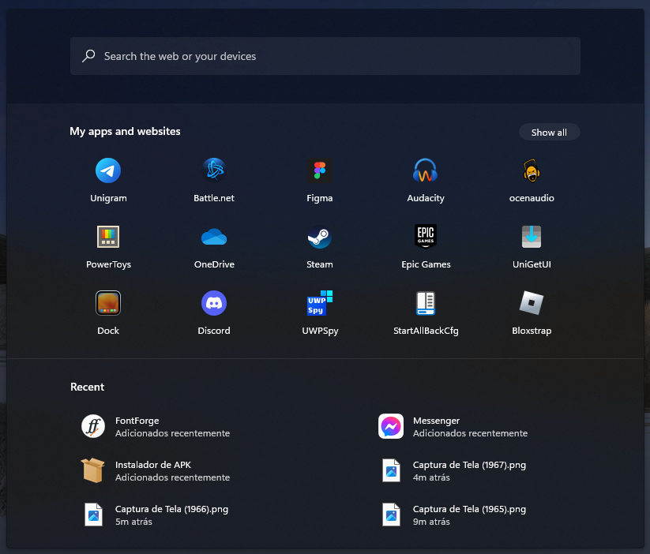

# Windows10X theme for Windows 11 Start Menu Styler

A theme aimed to recreate the Windows 10X start menu.

⚠️ The profile and power buttons have been removed, so you will need to use Ctrl+Alt+Del or Alt+F4 on the desktop to log out and access the power options.



## Manual installation

The theme can only be imported manually. To do that, follow these steps:

* Open the Windows 11 Start Menu Styler mod in Windhawk.
* Go to the "Advanced" tab.
* Copy the content below to the text box under "Mod settings" and click "Save".

<details>
<summary>Content to import (click to expand)</summary>

```json
{
  "controlStyles[0].target": "Button#CloseAllAppsButton",
  "controlStyles[0].styles[0]": "Margin=0,0,16,0",
  "controlStyles[0].styles[1]": "Padding=16,3,16,3",
  "controlStyles[0].styles[2]": "CornerRadius=12",
  "controlStyles[0].styles[3]": "BorderThickness=0",
  "controlStyles[1].target": "Grid#ShowMoreSuggestions",
  "controlStyles[1].styles[0]": "Visibility=1",
  "controlStyles[2].target": "Grid#SuggestionsParentContainer",
  "controlStyles[2].styles[0]": "Visibility=0",
  "controlStyles[3].target": "Grid#TopLevelSuggestionsListHeader",
  "controlStyles[3].styles[0]": "Visibility=0",
  "controlStyles[3].styles[1]": "Margin=0,-23,-180,0",
  "controlStyles[3].styles[2]": "BorderThickness=0,1,0,0",
  "controlStyles[3].styles[3]": "BorderBrush:=<SolidColorBrush Color=\"{ThemeResource SurfaceStrokeColorDefault}\" Opacity=\".5\"/>",
  "controlStyles[4].target": "Button#ShowAllAppsButton",
  "controlStyles[4].styles[0]": "Margin=0,0,80,0",
  "controlStyles[4].styles[1]": "CornerRadius=12",
  "controlStyles[4].styles[2]": "BorderThickness=0",
  "controlStyles[4].styles[3]": "Padding=16,3,16,3",
  "controlStyles[5].target": "StartDocked.SearchBoxToggleButton",
  "controlStyles[5].styles[0]": "Margin=80,4,80,51",
  "controlStyles[5].styles[1]": "Height=48",
  "controlStyles[6].target": "Microsoft.UI.Xaml.Controls.PipsPager#PinnedListPipsPager",
  "controlStyles[6].styles[0]": "Visibility=1",
  "controlStyles[7].target": "Border#AcrylicBorder",
  "controlStyles[7].styles[0]": "Background:=<AcrylicBrush TintColor=\"{ThemeResource ControlOnImageFillColorTertiary}\" TintOpacity=\".3\" TintLuminosityOpacity=\".96\" Opacity=\"1\"/>",
  "controlStyles[7].styles[1]": "CornerRadius=4",
  "controlStyles[7].styles[2]": "BorderThickness=0",
  "controlStyles[8].target": "Grid#MainContent",
  "controlStyles[8].styles[0]": "CornerRadius=3",
  "controlStyles[9].target": "StartMenu.PinnedList",
  "controlStyles[9].styles[0]": "Height=256",
  "controlStyles[9].styles[1]": "Margin=10,0,0,0",
  "controlStyles[10].target": "TextBlock#PinnedListHeaderText",
  "controlStyles[10].styles[0]": "Margin=16,0,0,0",
  "controlStyles[10].styles[1]": "Text=My apps and websites",
  "controlStyles[11].target": "Border#TaskbarSearchBackground",
  "controlStyles[11].styles[0]": "CornerRadius=3",
  "controlStyles[11].styles[1]": "Margin=81,36,81,10",
  "controlStyles[11].styles[2]": "BorderBrush:=<SolidColorBrush Color=\"{ThemeResource ControlStrokeColorDefault}\"/>",
  "controlStyles[11].styles[3]": "BorderThickness=0",
  "controlStyles[11].styles[4]": "Height=48",
  "controlStyles[12].target": "Border#AppBorder",
  "controlStyles[12].styles[0]": "Background:=<AcrylicBrush TintColor=\"{ThemeResource ControlOnImageFillColorTertiary}\" TintOpacity=\".3\" TintLuminosityOpacity=\".96\" Opacity=\"1\"/>",
  "controlStyles[12].styles[1]": "CornerRadius=4",
  "controlStyles[12].styles[2]": "BorderThickness=0",
  "controlStyles[13].target": "Border#dropshadow",
  "controlStyles[13].styles[0]": "Opacity=.6",
  "controlStyles[13].styles[1]": "CornerRadius=4",
  "controlStyles[14].target": "Cortana.UI.Views.RichSearchBoxControl#SearchBoxControl",
  "controlStyles[14].styles[0]": "Margin=81,36,81,10",
  "controlStyles[15].target": "Border#ContentBorder",
  "controlStyles[15].styles[0]": "CornerRadius=4",
  "controlStyles[16].target": "TextBlock#StatusMessage",
  "controlStyles[16].styles[0]": "Visibility=1",
  "controlStyles[17].target": "Border#LayerBorder",
  "controlStyles[17].styles[0]": "Visibility=1",
  "controlStyles[18].target": "Border#LogoBackgroundPlate",
  "controlStyles[18].styles[0]": "CornerRadius=2",
  "controlStyles[19].target": "TextBlock#AppDisplayName",
  "controlStyles[19].styles[0]": "Margin=-4,0,0,0",
  "controlStyles[20].target": "Grid#WebViewGrid",
  "controlStyles[20].styles[0]": "Margin=23,-40,26,0",
  "controlStyles[20].styles[1]": "Background=Transparent",
  "controlStyles[21].target": "Border#DropShadow",
  "controlStyles[21].styles[0]": "Opacity=.6",
  "controlStyles[21].styles[1]": "CornerRadius=4",
  "controlStyles[21].styles[2]": "Margin=-1",
  "controlStyles[22].target": "Button#Header > Border#Border > TextBlock#Text",
  "controlStyles[22].styles[0]": "FontWeight=600",
  "controlStyles[23].target": "Grid#QueryFormulationRoot",
  "controlStyles[23].styles[0]": "CornerRadius=0,0,4,4",
  "controlStyles[23].styles[1]": "BorderThickness=0",
  "controlStyles[23].styles[2]": "Margin=0,26,0,0",
  "controlStyles[23].styles[3]": "Background:=<SolidColorBrush Color=\"{ThemeResource ControlFillColorTertiary}\" Opacity=\"1\"/>",
  "controlStyles[24].target": "StartDocked.SearchBoxToggleButton > Grid > ContentPresenter > TextBlock#PlaceholderText",
  "controlStyles[24].styles[0]": "Text=Search the web or your devices",
  "controlStyles[24].styles[1]": "Margin=0",
  "controlStyles[24].styles[2]": "Foreground:=<SolidColorBrush Color=\"{ThemeResource FocusStrokeColorOuter}\" Opacity=\".75\"/>",
  "controlStyles[25].target": "TextBlock#ShowAllAppsButtonText",
  "controlStyles[25].styles[0]": "Margin=0",
  "controlStyles[25].styles[1]": "Text=Show all",
  "controlStyles[26].target": "Button#CloseAllAppsButton > ContentPresenter > StackPanel > TextBlock",
  "controlStyles[26].styles[0]": "Margin=8,-1,0,0",
  "controlStyles[27].target": "Button#CloseAllAppsButton > ContentPresenter > StackPanel > FontIcon > Grid > TextBlock",
  "controlStyles[27].styles[0]": "Margin=-2,0,0,0",
  "controlStyles[28].target": "StartDocked.LauncherFrame > Grid#RootGrid > Grid#RootContent > Grid#MainContent > Grid#InnerContent > Rectangle",
  "controlStyles[28].styles[0]": "Visibility=1",
  "controlStyles[29].target": "Border#AcrylicOverlay",
  "controlStyles[29].styles[0]": "Margin=0,119,0,-64",
  "controlStyles[29].styles[1]": "Padding=0,1,0,1",
  "controlStyles[29].styles[2]": "BorderThickness=0",
  "controlStyles[29].styles[3]": "CornerRadius=0",
  "controlStyles[30].target": "Cortana.UI.Views.RichSearchBoxControl#SearchBoxControl > Grid#RootGrid",
  "controlStyles[30].styles[0]": "BorderBrush:=<SolidColorBrush Color=\"{ThemeResource SystemAccentColorLight1}\"/>",
  "controlStyles[30].styles[1]": "CornerRadius=3",
  "controlStyles[30].styles[2]": "Margin=0,1,0,0",
  "controlStyles[30].styles[3]": "BorderThickness=0,0,0,2",
  "controlStyles[31].target": "FontIcon#SearchBoxOnTaskbarSearchGlyph",
  "controlStyles[31].styles[0]": "Visibility=0",
  "controlStyles[32].target": "Microsoft.UI.Xaml.Controls.AnimatedIcon#SearchIconPlayer",
  "controlStyles[32].styles[0]": "Visibility=1",
  "controlStyles[33].target": "StartDocked.SearchBoxToggleButton#StartMenuSearchBox > Grid@CommonStates",
  "controlStyles[33].styles[0]": "CornerRadius=3",
  "controlStyles[33].styles[1]": "BorderThickness=0",
  "controlStyles[34].target": "StartDocked.SearchBoxToggleButton#StartMenuSearchBox > Grid@CommonStates > Border#BorderElement",
  "controlStyles[33].styles[2]": "Background:=<SolidColorBrush Color=\"{ThemeResource ControlFillColorDefault}\"/>",
  "controlStyles[34].styles[0]": "CornerRadius=3",
  "controlStyles[34].styles[1]": "Margin=-1,0,-1,0",
  "controlStyles[34].styles[3]": "BorderThickness=0",
  "controlStyles[34].styles[2]": "Background=Transparent",
  "controlStyles[35].target": "StartDocked.SearchBoxToggleButton#StartMenuSearchBox > Grid@CommonStates > FontIcon > Grid > TextBlock",
  "controlStyles[35].styles[0]": "Margin=-1,0,0,1",
  "controlStyles[35].styles[1]": "FontFamily=Segoe MDL2 Assets",
  "controlStyles[35].styles[2]": "Text=",
  "controlStyles[35].styles[3]": "Foreground:=<SolidColorBrush Color=\"{ThemeResource FocusStrokeColorOuter}\"/>",
  "controlStyles[36].target": "Border#LayerBorder",
  "controlStyles[36].styles[0]": "CornerRadius=4",
  "controlStyles[37].target": "Cortana.UI.Views.TaskbarSearchPage",
  "controlStyles[37].styles[0]": "Margin=-28,42,-28,0",
  "controlStyles[37].styles[1]": "MaxWidth=808",
  "controlStyles[37].styles[2]": "Width=808",
  "controlStyles[38].target": "Cortana.UI.Views.TaskbarSearchPage > Grid#RootGrid@SearchBoxInputStates > Border#TaskbarSearchBackground",
  "controlStyles[38].styles[0]": "Background:=<SolidColorBrush Color=\"{ThemeResource TextFillColorInverse}\" Opacity=\".75\"/>",
  "controlStyles[39].target": "Image#SearchIconOn",
  "controlStyles[39].styles[0]": "Visibility=1",
  "controlStyles[40].target": "FontIcon#SearchGlyph",
  "controlStyles[40].styles[0]": "Visibility=0",
  "controlStyles[41].target": "Image#SearchIconOff",
  "controlStyles[41].styles[0]": "Visibility=1",
  "controlStyles[42].target": "FontIcon#SearchBoxOnTaskbarSearchGlyph",
  "controlStyles[42].styles[0]": "FontFamily=Segoe MDL2 Assets",
  "controlStyles[42].styles[1]": "Glyph=",
  "controlStyles[43].target": "GridView#PinnedList > Border > ScrollViewer#ScrollViewer > Border#Root > Grid # ScrollContentPresenter#ScrollContentPresenter > ItemsPresenter > GridViewItem > Border#ContentBorder > Grid#DroppedFlickerWorkaroundWrapper > ContentPresenter#ContentPresenter > Grid",
  "controlStyles[43].styles[0]": "Height=84",
  "controlStyles[43].styles[1]": "Width=100",
  "controlStyles[44].target": "Grid#DroppedFlickerWorkaroundWrapper",
  "controlStyles[44].styles[0]": "Margin=38,0,0,0",
  "controlStyles[45].target": "Grid#UndockedRoot",
  "controlStyles[45].styles[0]": "Margin=0,0,0,-65",
  "controlStyles[46].target": "StartDocked.NavigationPaneView#NavigationPane",
  "controlStyles[46].styles[0]": "Visibility=1",
  "controlStyles[47].target": "Button#ShowAllAppsButton > ContentPresenter > StackPanel > FontIcon",
  "controlStyles[47].styles[0]": "Visibility=1",
  "controlStyles[48].target": "Button#CloseAllAppsButton > ContentPresenter > StackPanel > FontIcon",
  "controlStyles[48].styles[0]": "Visibility=1",
  "controlStyles[49].target": "Button#CloseAllAppsButton > ContentPresenter > StackPanel > TextBlock",
  "controlStyles[49].styles[0]": "Margin=0",
  "controlStyles[50].target": "StartDocked.AllAppsPane#AllAppsPanel",
  "controlStyles[50].styles[0]": "Margin=28,0,28,-65",
  "controlStyles[51].target": "FontIcon",
  "controlStyles[51].styles[0]": "FontFamily=Segoe MDL2 Assets",
  "controlStyles[52].target": "MenuFlyoutPresenter",
  "controlStyles[52].styles[0]": "CornerRadius=2",
  "controlStyles[53].target": "StartDocked.StartSizingFrame",
  "controlStyles[53].styles[0]": "MaxHeight=684",
  "controlStyles[53].styles[1]": "Height=684",
  "controlStyles[53].styles[2]": "MaxWidth=808",
  "controlStyles[54].target": "TextBlock#DisplayName",
  "controlStyles[54].styles[0]": "Margin=0,10,0,-16",
  "controlStyles[55].target": "TextBlock#AllAppsHeading",
  "controlStyles[55].styles[0]": "Margin=17,0,0,0",
  "controlStyles[56].target": "TextBlock#TopLevelSuggestionsListHeaderText",
  "controlStyles[56].styles[0]": "Margin=80,25,0,0",
  "controlStyles[56].styles[1]": "Text=Recent",
  "controlStyles[57].target": "GridView#RecommendedList > Border > ScrollViewer#ScrollViewer > Border#Root > Grid > ScrollContentPresenter#ScrollContentPresenter > ItemsPresenter > ItemsWrapGrid > GridViewItem > Border#ContentBorder > Grid#DroppedFlickerWorkaroundWrapper",
  "controlStyles[57].styles[0]": "Margin=0",
  "controlStyles[58].target": "GridView#RecommendedList",
  "controlStyles[58].styles[0]": "Margin=29,0,0,0",
  "controlStyles[59].target": "GridView#RecommendedList > Border > ScrollViewer#ScrollViewer > Border#Root > Grid > ScrollContentPresenter#ScrollContentPresenter > ItemsPresenter > ItemsWrapGrid > GridViewItem",
  "controlStyles[59].styles[0]": "Margin=0,0,109,0",
  "controlStyles[60].target": "Windows.UI.Xaml.Controls.Primitives.ScrollBar#VerticalScrollBar",
  "controlStyles[60].styles[0]": "Margin=0,0,42,0",
  "webContentStyles[0].target": "#qfPreviewPane",
  "webContentStyles[0].styles[0]": "min-width:324px !important",
  "webContentStyles[0].styles[1]": "display: none !important",
  "webContentStyles[1].target": "#qfContainer",
  "webContentStyles[1].styles[0]": "max-width: 632px !important",
  "webContentStyles[1].styles[1]": "margin-left: 51px !important",
  "webContentStyles[2].target": ".cortanaFontIcon, .iconContent",
  "webContentStyles[2].styles[0]": "font-family: 'Segoe MDL2 Assets' !important"
}
```
