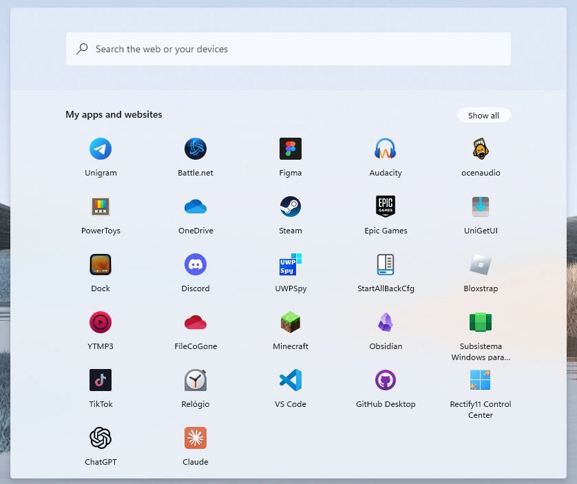

# Windows10X theme for Windows 11 Start Menu Styler

A theme aimed to recreate the Windows 10X start menu.



## Manual installation

The theme can only be imported manually. To do that, follow these steps:

* Open the Windows 11 Start Menu Styler mod in Windhawk.
* Go to the "Advanced" tab.
* Copy the content below to the text box under "Mod settings" and click "Save".

<details>
<summary>Content to import (click to expand)</summary>

```json
{
  "controlStyles[0].target": "Button#CloseAllAppsButton",
  "controlStyles[0].styles[0]": "Margin=0,0,-12,0",
  "controlStyles[0].styles[1]": "Padding=10,0,10,0",
  "controlStyles[0].styles[2]": "Height=26",
  "controlStyles[0].styles[3]": "CornerRadius=14",
  "controlStyles[0].styles[4]": "BorderThickness=0",
  "controlStyles[1].target": "Grid#ShowMoreSuggestions",
  "controlStyles[1].styles[0]": "Visibility=1",
  "controlStyles[2].target": "Grid#SuggestionsParentContainer",
  "controlStyles[3].target": "Grid#TopLevelSuggestionsListHeader",
  "controlStyles[3].styles[0]": "Visibility=1",
  "controlStyles[2].styles[0]": "Visibility=1",
  "controlStyles[4].target": "Button#ShowAllAppsButton",
  "controlStyles[4].styles[0]": "Margin=0,0,52,0",
  "controlStyles[4].styles[1]": "Height=26",
  "controlStyles[4].styles[2]": "CornerRadius=14",
  "controlStyles[4].styles[3]": "BorderThickness=0",
  "controlStyles[4].styles[4]": "Padding=10,0,10,0",
  "controlStyles[5].target": "StartDocked.SearchBoxToggleButton",
  "controlStyles[5].styles[0]": "Margin=32,1,32,24",
  "controlStyles[5].styles[1]": "Height=40",
  "controlStyles[5].styles[2]": "CornerRadius=4",
  "controlStyles[6].target": "Microsoft.UI.Xaml.Controls.PipsPager#PinnedListPipsPager",
  "controlStyles[6].styles[0]": "Visibility=1",
  "controlStyles[7].target": "Border#AcrylicBorder",
  "controlStyles[7].styles[0]": "Background:=<AcrylicBrush TintColor=\"{ThemeResource ControlOnImageFillColorTertiary}\" TintOpacity=\".25\" TintLuminosityOpacity=\".96\" Opacity=\"1\"/>",
  "controlStyles[7].styles[1]": "CornerRadius=4",
  "controlStyles[7].styles[2]": "BorderThickness=0",
  "controlStyles[8].target": "Grid#MainContent",
  "controlStyles[8].styles[0]": "CornerRadius=8",
  "controlStyles[9].target": "StartMenu.PinnedList",
  "controlStyles[9].styles[0]": "Height=500",
  "controlStyles[10].target": "TextBlock#DisplayName",
  "controlStyles[10].styles[0]": "Margin=0,12,0,-16",
  "controlStyles[10].styles[1]": "Opacity=.85",
  "controlStyles[11].target": "TextBlock#PinnedListHeaderText",
  "controlStyles[11].styles[0]": "Margin=-12,0,0,0",
  "controlStyles[11].styles[1]": "Text=My apps and websites",
  "controlStyles[12].target": "Border#TaskbarSearchBackground",
  "controlStyles[12].styles[0]": "CornerRadius=4",
  "controlStyles[12].styles[1]": "Margin=33,33,33,10",
  "controlStyles[12].styles[2]": "BorderBrush:=<SolidColorBrush Color=\"{ThemeResource ControlStrokeColorDefault}\"/>",
  "controlStyles[12].styles[3]": "BorderThickness=1,1,1,0",
  "controlStyles[12].styles[4]": "Height=40",
  "controlStyles[13].target": "Border#AppBorder",
  "controlStyles[13].styles[0]": "Background:=<AcrylicBrush TintColor=\"{ThemeResource ControlOnImageFillColorTertiary}\" TintOpacity=\".25\" TintLuminosityOpacity=\".96\" Opacity=\"1\"/>",
  "controlStyles[13].styles[1]": "CornerRadius=4",
  "controlStyles[13].styles[2]": "BorderThickness=0",
  "controlStyles[14].target": "Border#dropshadow",
  "controlStyles[14].styles[0]": "Opacity=.6",
  "controlStyles[14].styles[1]": "CornerRadius=4",
  "controlStyles[15].target": "Cortana.UI.Views.RichSearchBoxControl#SearchBoxControl",
  "controlStyles[15].styles[0]": "Margin=33,33,33,10",
  "controlStyles[16].target": "TextBlock#UserTileNameText",
  "controlStyles[16].styles[0]": "Opacity=.85",
  "controlStyles[17].target": "Border#ContentBorder",
  "controlStyles[17].styles[0]": "CornerRadius=4",
  "controlStyles[18].target": "GridViewItem",
  "controlStyles[18].styles[0]": "Height=92",
  "controlStyles[19].target": "TextBlock#StatusMessage",
  "controlStyles[19].styles[0]": "Visibility=1",
  "controlStyles[20].target": "Border#LayerBorder",
  "controlStyles[20].styles[0]": "Visibility=1",
  "controlStyles[21].target": "Border#LogoBackgroundPlate",
  "controlStyles[21].styles[0]": "CornerRadius=2",
  "controlStyles[22].target": "TextBlock#AppDisplayName",
  "controlStyles[22].styles[0]": "Margin=-4,0,0,0",
  "controlStyles[22].styles[1]": "Opacity=.85",
  "controlStyles[23].target": "Grid#WebViewGrid > WebView",
  "controlStyles[23].styles[0]": "Margin=5,8,8,33",
  "controlStyles[24].target": "Border#DropShadow",
  "controlStyles[24].styles[0]": "Opacity=.6",
  "controlStyles[24].styles[1]": "CornerRadius=6",
  "controlStyles[24].styles[2]": "Margin=-1",
  "controlStyles[25].target": "Button#Header > Border#Border > TextBlock#Text",
  "controlStyles[25].styles[0]": "FontWeight=600",
  "controlStyles[26].target": "Grid#QueryFormulationRoot",
  "controlStyles[26].styles[0]": "CornerRadius=0,0,8,8",
  "controlStyles[27].target": "StartDocked.SearchBoxToggleButton > Grid > ContentPresenter > TextBlock#PlaceholderText",
  "controlStyles[27].styles[0]": "Text=Search the web and your stuff",
  "controlStyles[27].styles[1]": "Margin=0,0,0,0",
  "controlStyles[27].styles[2]": "Foreground:=<SolidColorBrush Color=\"{ThemeResource FocusStrokeColorOuter}\" Opacity=\".75\"/>",
  "controlStyles[28].target": "TextBlock#ShowAllAppsButtonText",
  "controlStyles[28].styles[0]": "Margin=0,-1,7,0",
  "controlStyles[28].styles[1]": "Opacity=.89",
  "controlStyles[28].styles[2]": "Text=All apps",
  "controlStyles[29].target": "Button#CloseAllAppsButton > ContentPresenter > StackPanel > TextBlock",
  "controlStyles[29].styles[0]": "Margin=8,-1,0,0",
  "controlStyles[29].styles[1]": "Opacity=.89",
  "controlStyles[30].target": "Button#CloseAllAppsButton > ContentPresenter > StackPanel > FontIcon > Grid > TextBlock",
  "controlStyles[30].styles[0]": "Margin=-2,0,0,0",
  "controlStyles[31].target": "TextBlock#PlaceholderTextContentPresenter",
  "controlStyles[31].styles[0]": "FontSize=14",
  "controlStyles[32].target": "Cortana.UI.Views.CortanaRichSearchBox#SearchTextBox",
  "controlStyles[32].styles[0]": "FontWeight=600",
  "controlStyles[33].target": "StartDocked.LauncherFrame > Grid#RootGrid > Grid#RootContent > Grid#MainContent > Grid#InnerContent > Rectangle",
  "controlStyles[33].styles[0]": "Visibility=1",
  "controlStyles[34].target": "Border#AcrylicOverlay",
  "controlStyles[34].styles[0]": "Margin=0,104,0,0",
  "controlStyles[34].styles[1]": "CornerRadius=0",
  "controlStyles[34].styles[2]": "Padding=1,0,1,0",
  "controlStyles[34].styles[3]": "BorderThickness=0",
  "controlStyles[35].target": "Cortana.UI.Views.RichSearchBoxControl#SearchBoxControl > Grid#RootGrid",
  "controlStyles[35].styles[0]": "BorderBrush:=<SolidColorBrush Color=\"{ThemeResource SystemAccentColorLight1}\"/>",
  "controlStyles[35].styles[1]": "CornerRadius=4",
  "controlStyles[35].styles[2]": "Margin=0,1,0,0",
  "controlStyles[35].styles[3]": "BorderThickness=0,0,0,2",
  "controlStyles[36].target": "FontIcon#SearchBoxOnTaskbarSearchGlyph",
  "controlStyles[36].styles[0]": "Visibility=0",
  "controlStyles[37].target": "Microsoft.UI.Xaml.Controls.AnimatedIcon#SearchIconPlayer",
  "controlStyles[37].styles[0]": "Visibility=1",
  "controlStyles[38].target": "StartDocked.SearchBoxToggleButton#StartMenuSearchBox > Grid@CommonStates",
  "controlStyles[38].styles[0]": "CornerRadius=4",
  "controlStyles[38].styles[1]": "BorderThickness=0",
  "controlStyles[39].target": "StartDocked.SearchBoxToggleButton#StartMenuSearchBox > Grid@CommonStates > Border#BorderElement",
  "controlStyles[38].styles[2]": "Background:=<SolidColorBrush Color=\"{ThemeResource ControlFillColorDefault}\"/>",
  "controlStyles[39].styles[0]": "CornerRadius=4",
  "controlStyles[39].styles[1]": "Margin=-1,0,-1,0",
  "controlStyles[39].styles[3]": "BorderThickness=0",
  "controlStyles[39].styles[2]": "Background=transparent",
  "controlStyles[40].target": "StartDocked.SearchBoxToggleButton#StartMenuSearchBox > Grid@CommonStates > FontIcon > Grid > TextBlock",
  "controlStyles[40].styles[0]": "Margin=-1,0,0,1",
  "controlStyles[40].styles[1]": "FontFamily=Segoe MDL2 Assets",
  "controlStyles[40].styles[2]": "Text=",
  "controlStyles[40].styles[3]": "Foreground:=<SolidColorBrush Color=\"{ThemeResource FocusStrokeColorOuter}\" Opacity=\".85\"/>",
  "controlStyles[41].target": "Border#LayerBorder",
  "controlStyles[41].styles[0]": "CornerRadius=4",
  "controlStyles[42].styles[0]": "Background:=<SolidColorBrush Color=\"{ThemeResource ControlFillColorTertiary}\" Opacity=\"1\"/>",
  "controlStyles[42].target": "Grid#QueryFormulationRoot",
  "controlStyles[42].styles[1]": "Margin=0,22,0,0",
  "controlStyles[42].styles[2]": "BorderBrush:=<SolidColorBrush Color=\"black\" Opacity=\".0605\"/>",
  "controlStyles[42].styles[3]": "BorderThickness=0,1,0,0",
  "controlStyles[43].target": "Cortana.UI.Views.TaskbarSearch Page",
  "controlStyles[43].styles[0]": "Margin=67,0,67,0",
  "controlStyles[44].target": "Grid#WebViewGrid > WebView",
  "controlStyles[44].styles[0]": "Margin=5,-40,8,32",
  "controlStyles[45].target": "Cortana.UI.Views.TaskbarSearchPage > Grid#RootGrid@SearchBoxInputStates > Border#TaskbarSearchBackground",
  "controlStyles[45].styles[0]": "Background:=<SolidColorBrush Color=\"{ThemeResource TextFillColorInverse}\" Opacity=\".75\"/>",
  "controlStyles[46].target": "Image#SearchIconOn",
  "controlStyles[46].styles[0]": "Visibility=1",
  "controlStyles[47].target": "FontIcon#SearchGlyph",
  "controlStyles[47].styles[0]": "Visibility=0",
  "controlStyles[48].target": "Image#SearchIconOff",
  "controlStyles[48].styles[0]": "Visibility=1",
  "controlStyles[49].target": "StartDocked.SearchBoxToggleButton",
  "controlStyles[49].styles[0]": "Margin=52,1,52,49",
  "controlStyles[50].target": "FontIcon#SearchBoxOnTaskbarSearchGlyph",
  "controlStyles[50].styles[0]": "FontFamily=Segoe MDL2 Assets",
  "controlStyles[50].styles[1]": "Glyph="
}
```
